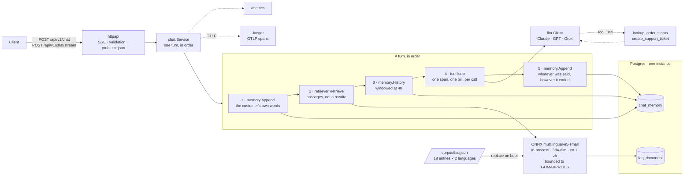

# AI Customer Service System — Go

[](https://github.com/lai3d/ai-customer-service-go/actions/workflows/ci.yml)
[](https://go.dev/)
[](LICENSE)

[中文](README.zh.md) · **English**

An AI customer service backend in Go: retrieval-augmented answers over a bilingual FAQ
corpus, tool calling for real business actions, SSE streaming, a per-conversation token
budget, Prometheus metrics and OpenTelemetry traces. The embedding model runs in this
process; the chat model is Anthropic Claude by default, with OpenAI and xAI selectable by
configuration.

**This is the second implementation of a system that already exists
[in Java](https://github.com/lai3d/ai-customer-service-java).** It is not a port. The two
share a corpus, a set of measurements and a method, and nothing else — and the comparison
is the point. Where the numbers differ, both are reported. Where this implementation
found the Java one wrong, it says so; where the Java one found this one wrong, that is
recorded too.

---

## What this project found


| | |
| --- | --- |
| In-process embedding in Go is viable and costs 2 ms a query — the bill is cgo, and it is paid in OS threads | [Retrieval](docs/retrieval.md#in-process-embedding-in-go-yes-and-it-costs-cgo) |
| The token-accounting rule everyone is warned about was a property of one framework, not of the wire | [Cost and failure](docs/reliability.md#a-turn-is-not-a-model-call) |
| Goroutines beat Loom by 20% on the same workload and spent 3–7× the OS threads doing it | [Benchmark](docs/benchmark.md) |
| A similarity threshold that "nearly worked" flipped sign on a re-drawn sample of the same size | [Retrieval](docs/retrieval.md#no-similarity-threshold-is-worth-setting-with-this-model) |
| Four samples made a threshold look defensible; the eleventh disproved it | [Retrieval](docs/retrieval.md#the-sample-size-is-a-lesson-in-both-directions) |
| Bounding cgo concurrency cut threads 3–7×, cost 11% throughput, and *improved* p50 | [Benchmark](docs/benchmark.md#asking-go-for-the-jvms-behaviour) |
| A constant benchmark delay flatters every runtime — and the OS thread count turns out to measure arrival concentration, not load | [Benchmark](docs/benchmark.md#a-constant-delay-flatters-everything) |
| The customer's words reach no span — checked by grepping the backend, not by reading docs | [Observability](docs/observability.md#the-customers-words-are-not-in-the-trace-and-that-was-checked-rather-than-assumed) |
| Every provider's current model rejects `temperature`, and the OpenAI protocol hides usage unless asked | [Chat providers](docs/providers.md#what-only-a-live-call-found) |
| A cost meter that silently reads zero is worse than none, so the misses are counted | [Cost and failure](docs/reliability.md#the-model-in-the-metrics-is-not-the-model-you-asked-for) |
| An abandoned stream had already been billed, and the test that would have caught it could only pass because it tested the stub | [Cost and failure](docs/reliability.md#an-abandoned-stream-has-usually-already-been-billed) |
| The customer's words were not in the spans, but a model-invented tool name was — a span name is an aggregated dimension too | [Observability](docs/observability.md#attributes-are-not-the-only-way-into-a-backend) |
| The page showed the model's markdown as literal asterisks, and only a real browser noticed | [The demo UI](docs/demo-ui.md#it-renders-the-models-markdown-in-a-deliberately-small-subset) |
| Two browser tabs on one conversation interleaved, and the second request lost its retrieved passages silently | [Cost and failure](docs/reliability.md#one-turn-at-a-time-per-conversation) |
| The server emitted every failure correctly and the shipped client dropped all of them | [The demo UI](docs/demo-ui.md#the-page-dispatches-on-the-event-name) |

---

## Where the runtime moved the check


The most useful thing about having two implementations is not the latency table. It is
that three bugs the Java version has to hold down with tests **cannot be written here**,
and three others exist here that could not exist there.

| The Java implementation must test that… | Here it is… |
| --- | --- |
| the memory advisor runs before the retrieval advisor, or retrieved passages are written into the customer's history and re-sent forever | impossible: retrieval returns passages, and the caller composes the prompt. Memory never sees them. |
| the `query: ` / `passage: ` markers are applied to the right side | impossible: `Embedder` has `EmbedQuery` and `EmbedPassages` and no `Embed`. |
| every path to the model populates `ToolContext`, or ticket creation fails at runtime once a conversation escalates | a compile error: the conversation id is a parameter. |
| — | **but**: nothing stops a goroutine blocking an OS thread inside cgo, which is a measured cost the JVM's bounded carrier pool does not have. |
| — | **but**: `http.Client` has no default timeout at all, where Spring at least had a bad one. |
| — | **but**: a `nil` map, an unchecked `err`, and a data race are all still available. |

Neither runtime is safer. They move the same class of problem to different places, and
"same system, two runtimes" is most interesting exactly where a check migrates between
compile time, test time and production.

---

## Architecture




**Why these pieces:**

| Decision | Reason |
| --- | --- |
| Goroutines, stdlib `net/http`, no framework | An LLM call is a long blocking wait, which is what goroutines are for. [Measured](docs/benchmark.md) at 600 req/s against Loom's 500 on the same path and machine. |
| A turn is a function, not an advisor chain | The two ordering constraints that a chain has to enforce with conventions are enforced here by the order of five statements you can read on one screen. |
| pgvector in the business database | One database to run, back up and reason about. A ticket and the conversation that created it could be written in one transaction. |
| In-process ONNX embeddings | Anthropic has no embedding API. Local means no second vendor, no second key, nothing per query — at the cost of cgo, [measured](docs/benchmark.md). |
| Embedding concurrency bounded by default | A goroutine in a cgo call blocks an OS thread and Go's answer is to make another. Bounding holds the count at 40 instead of 276 for 11% of throughput. |
| Prices and tokens metered by model, never by conversation | Per-conversation tags grow cardinality without limit and take the metrics backend down long before the bill does. |

---

## Quick start


**Prerequisites:** Go 1.26, Docker, and an Anthropic API key.

```bash
make deps                    # native libraries + the 470 MB embedding model, once
cp .env.example .env
$EDITOR .env                 # set ANTHROPIC_API_KEY

docker compose up -d         # Postgres 5433, Jaeger 16687, the app on 8081
open http://localhost:8081   # the demo UI
```

Or run the app from source against just the database:

```bash
docker compose up -d postgres jaeger
make run
```

```bash
curl -s localhost:8081/healthz
curl -s localhost:8081/metrics | grep '^chat_'
open http://localhost:16687  # Jaeger: every turn, span by span
```

Ports deliberately avoid the Java implementation's, so both stacks can run on one machine.

Run the tests — Testcontainers starts its own pgvector, the real embedding model is used
throughout, and nothing reaches a chat API, so **no key is needed**:

```bash
make test
make test-race
make bench                   # opt-in; measures a machine, not a behaviour
```

---

## API


Both endpoints take the same body. Omit `conversationId` to start a new conversation; the
assigned id comes back in the `X-Conversation-Id` header.

```bash
curl -sS localhost:8081/api/v1/chat \
  -H 'Content-Type: application/json' \
  -d '{"message": "Where is my order ORD-10042?"}' | jq

curl -N localhost:8081/api/v1/chat/stream \
  -H 'Content-Type: application/json' \
  -d '{"conversationId": "abc-123", "message": "And if it was a gift?"}'
```

The stream carries typed events rather than bare tokens — `retrieval`, `tool`, `message`,
`usage`, `error`. A chat widget reads `message` and `error` and ignores the rest;
everything else is there because the interesting part of this system is the part a widget
hides.

```
event: retrieval
data: {"type":"retrieval","passages":[{"entryId":"shipping-cost","language":"zh","score":0.9286,…}]}

event: tool
data: {"type":"tool","tool":{"name":"lookup_order_status","outcome":"found"}}

event: message
data: {"type":"message","text":"Standard delivery is free over $50"}

event: usage
data: {"type":"usage","usage":{"model":"claude-opus-5","modelCalls":2,"inputTokens":3874,…}}
```

`retrieval` arrives **before** the model is called, so a client can show it while the
model is still thinking — and so it survives a model call that fails, which is exactly
when someone debugging a bad answer needs it.

### The same request, asked in Chinese

Nothing is configured differently. The corpus is indexed in both languages, so a Chinese
question matches Chinese passages and the answer comes back in Chinese, with the same
tool call and the same accounting behind it.

```bash
curl -sS localhost:8081/api/v1/chat \
  -H 'Content-Type: application/json' \
  -d '{"message": "我的订单 ORD-10042 什么时候到？退货有时间限制吗"}' | jq
```

```
passages   returns-window (zh) · account-order-history (zh) · returns-how (zh)
tools      lookup_order_status → found
usage      2 model calls
reply      关于你的两个问题：
           **订单 ORD-10042** — 状态：运输中 · 预计送达：2026-09-03 · 承运商：SingPost …
```

Two model calls, because the model asked for the tool and then answered with its result.
Cross-lingual retrieval is measured separately, and it has to be: same-language matches
score high enough that every Chinese passage outranks every English one, so a Chinese
question finding the right *English* passage is only visible with the other half filtered
out. See [Retrieval](docs/retrieval.md#retrieval-quality).

---

## Deeper reading


| | |
| --- | --- |
| [Retrieval](docs/retrieval.md) | In-process embedding in Go, what it costs, and why no similarity threshold is worth setting |
| [Cost and failure](docs/reliability.md) | Token accounting, budgets, timeouts, bounded tool side effects, graceful shutdown |
| [Benchmark](docs/benchmark.md) | Goroutines against Loom, and what a cgo call does to the OS thread count |
| [Footprint](docs/footprint.md) | What a pod of each implementation costs to run, and why a memory number needs a stated moment |
| [Tool calling](docs/tools.md) | Why a missing order is a value, and why conversation identity is a parameter |
| [Chat providers](docs/providers.md) | Anthropic, OpenAI and xAI — and why xAI is a provider rather than a base-URL trick |
| [Observability](docs/observability.md) | GenAI spans over OTLP, and grepping the backend to prove the customer's words are not in it |
| [The demo UI](docs/demo-ui.md) | A glass box rather than a chat widget, and why the score bars are normalised |

---

## Status


Verified live against `claude-opus-5`, `gpt-5` and `grok-4.6`: each answers a question
from the corpus, calls a tool and uses its result, and reports usage that reaches the
budget, the meters and the spans. A Chinese question retrieves Chinese passages and is
answered in Chinese. Over eighty tests, no API key, real pgvector and the real embedding
model throughout.

**What is not done, stated rather than implied:**

- **No Gemini.** Three providers, not four. The Java implementation's Gemini findings are
  linked and *not re-verified here*.
- **The Kubernetes manifests are verified on kind, not on a real cluster.** Twelve
  assertions run against a throwaway cluster (`k8s/kind/verify.sh`); no production
  cluster has seen them. Ingress, HPA, PodDisruptionBudget and NetworkPolicy are
  deliberately absent — see [k8s/README.md](k8s/README.md#deliberately-not-included).
- **The per-conversation lock is per process.** Two replicas can still interleave one
  conversation; the real fix is Postgres advisory locks.
- **`top-k: 8` is inherited, not re-measured.** It comes from the Java implementation's
  recall-against-tokens table, and the multi-intent limit it documents — one of fourteen
  long questions still misses the passage that answers it — has not been re-measured here.
- **No evaluation harness.** The retrieval measurements say which passage was found, not
  whether the answer built from it was good.
- ~~The ticket cap is per replica~~ — **fixed.** Tickets are in Postgres now, with the cap and the deduplication enforced by a transaction and a unique index. `TestTheCapHoldsAcrossReplicas` runs twenty differently-worded requests across two pools: three tickets with the lock, seventeen without it.
- **The demo page was verified headless**, with a throwaway profile. Font fallback and
  anything gated on a real display are not covered.

- **No admin surface, and this one is a divergence rather than a gap.** The Java
  implementation is building one. This repository is not, because the two are the same
  decision seen from different sides: an admin view of tickets and conversations is a page
  showing the most sensitive text in the system, and both implementations have gone to
  some trouble to keep that text out of traces and logs. Adding the page without
  authentication undoes that; adding authentication leaves the shared scope both READMEs
  declare. Neither is wrong — but the pair stops being symmetric here, and it is recorded
  rather than left for a reader to notice.

Deliberately out of scope: authentication, multi-tenancy, MCP.

---

## Project layout


```
├── Dockerfile            # 4 stages; the model baked in, no runtime downloads
├── k8s/                  # manifests + a kind harness that verifies them
├── docker-compose.yml    # Postgres, Jaeger, the app -- ports avoid the Java stack's
├── cmd/server/           # wiring, health, graceful shutdown
├── corpus/faq.json       # byte-identical to the Java implementation's
├── internal/
│   ├── benchmark/        # build-tagged; measures a machine, not a behaviour
│   ├── chat/             # a turn, in order: memory, retrieval, the tool loop
│   ├── config/           # every tunable, with the reasoning next to it
│   ├── cost/             # conversation budget and prices
│   ├── httpapi/          # validation, SSE, problem+json, the embedded demo page
│   ├── llm/              # the provider boundary: Anthropic, OpenAI, xAI
│   ├── obs/              # metrics and traces
│   ├── rag/              # corpus, ONNX embedder, pgvector, retriever
│   ├── store/            # pool and schema
│   └── tools/            # order lookup, support tickets
└── scripts/fetch-deps.sh # the honest cost of an in-process model
```

---

## License


[Apache License 2.0](LICENSE)
