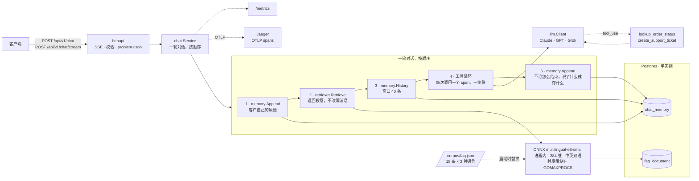

# AI 客服系统 — Go 实现

[](https://github.com/lai3d/ai-customer-service-go/actions/workflows/ci.yml)
[](https://go.dev/)
[](LICENSE)

**中文** · [English](README.md)

一个用 Go 写的 AI 客服后端：在双语 FAQ 语料上做检索增强问答、用工具调用完成真实业务动作、
SSE 流式输出、按会话计的 token 预算、Prometheus 指标和 OpenTelemetry 链路。**嵌入模型跑在
本进程内**；对话模型默认是 Anthropic Claude，OpenAI 和 xAI 通过配置切换。

**这是同一套系统的第二个实现，第一个[在 Java 里](https://github.com/lai3d/ai-customer-service-java/blob/main/README.zh.md)。**
（那边的 [English README](https://github.com/lai3d/ai-customer-service-java)。）
它不是移植。两边共享一份语料、一套测量方法和一套判断标准，除此之外没有任何共用代码 ——
**对比本身才是目的**。数字不一致的地方，两个数字都会报出来。这个实现发现 Java 那边错了，
会写下来；Java 那边发现这边错了，同样记录在案。

---

## 这个项目测出了什么


| | |
| --- | --- |
| 进程内嵌入在 Go 里可行，每次查询 2ms —— 代价是 cgo，而这笔账是用 OS 线程付的 | [检索](docs/retrieval.md#in-process-embedding-in-go-yes-and-it-costs-cgo) |
| 那条人人被警告的 token 记账规则，是某个框架的性质，不是 wire 的性质 | [成本与失败](docs/reliability.md#a-turn-is-not-a-model-call) |
| 同样的负载下 goroutine 比 Loom 快 20%，代价是 3–7 倍的 OS 线程 | [Benchmark](docs/benchmark.md) |
| 一个"差点管用"的相似度阈值，在同样大小的重新取样下**符号翻转** | [检索](docs/retrieval.md#no-similarity-threshold-is-worth-setting-with-this-model) |
| 4 个样本让一个阈值看起来站得住，第 11 个推翻了它 | [检索](docs/retrieval.md#the-sample-size-is-a-lesson-in-both-directions) |
| 限制 cgo 并发把线程砍掉 3–7 倍，吞吐降 11%，而 p50 **反而变好** | [Benchmark](docs/benchmark.md#asking-go-for-the-jvms-behaviour) |
| 固定的 benchmark 延迟会美化所有运行时 —— 而 OS 线程数其实测的是到达集中度，不是负载 | [Benchmark](docs/benchmark.md#a-constant-delay-flatters-everything) |
| 客户的原话不会进入任何 span —— 这是 grep 后端验的，不是读文档得出的 | [可观测性](docs/observability.md#the-customers-words-are-not-in-the-trace-and-that-was-checked-rather-than-assumed) |
| 每家 provider 的当前模型都拒绝 `temperature`；OpenAI 协议不主动要就不给用量 | [对话 provider](docs/providers.md#what-only-a-live-call-found) |
| 一个静默读零的成本指标比没有指标更糟，所以"漏掉的"要被计数 | [成本与失败](docs/reliability.md#the-model-in-the-metrics-is-not-the-model-you-asked-for) |
| 被放弃的流其实早已计费；而本该抓到它的测试之所以能通过，是因为它测的是 stub | [成本与失败](docs/reliability.md#an-abandoned-stream-has-usually-already-been-billed) |
| 一个被拒绝的操作没有留下任何痕迹——审计记下了所有成功的动作，没记下任何被拒的 | [运营后台](docs/operations.md#reading-is-an-action) |
| 关掉标签页的客户被记成了数据库故障，而那份记录的全部职责就是区分这两件事 | [运营后台](docs/operations.md#the-turn-record-is-not-the-chat-memory) |
| 一个安全响应头写在配置里却没出现在响应上——nginx 不会把 add_header 继承进自己也设了 add_header 的 location | [运营后台](docs/operations.md#what-the-container-found-which-a-laptop-would-not-have) |
| 重新载入语料会静默地劣化检索：被删除的行仍留在 HNSW 索引里，而近似扫描会把候选名额花在它们身上 | [检索](docs/retrieval.md#reloading-the-corpus-used-to-degrade-the-index) |
| 答案评测拿到 100%，而这个数字毫无意义——直到同一套 harness 在没有语料的情况下跑出 42.9% | [评测](docs/evaluation.md#the-numbers) |
| 工单被开出来、去重、限量、审计——然后没有任何人被告知它存在 | [人工闭环](docs/handoff.md#outbound-a-webhook-and-the-decision-it-does-not-make-for-you) |
| 服务端的拒绝信息渲染在可视区域下方 38 像素处，于是客户只看到自己那条长消息、看不到任何理由 | [演示界面](docs/demo-ui.md#an-error-the-customer-could-not-see) |
| 一个本仓库三次测量都无法证明其必要性的配置被保留了下来，并标注为"基于论证而非证据" | [知识库](docs/knowledge.md#hnswiterative_scan-argued-not-evidenced-here) |
| 客户原话没进 span，但模型编造的工具名进了 —— span 名同样是聚合维度 | [可观测性](docs/observability.md#attributes-are-not-the-only-way-into-a-backend) |
| 页面把模型的 markdown 当字面星号显示，只有真实浏览器发现了 | [演示界面](docs/demo-ui.md#it-renders-the-models-markdown-in-a-deliberately-small-subset) |
| 同一会话开两个标签页会交错，第二个请求的检索段落被静默丢弃 | [成本与失败](docs/reliability.md#one-turn-at-a-time-per-conversation) |
| 服务端每个失败都正确发出了，而我们自己发布的客户端全部丢弃 | [演示界面](docs/demo-ui.md#the-page-dispatches-on-the-event-name) |

---

## 运行时把检查挪到了哪里


有两个实现，最有价值的不是那张延迟表。而是 Java 版必须用测试摁住的三个 bug 在这边
**根本写不出来**，同时这边存在三个 Java 那边不可能有的隐患。

| Java 实现必须测试…… | 这边则是…… |
| --- | --- |
| 记忆 advisor 必须先于检索 advisor 运行，否则检索到的段落会写进客户历史并被永远重发 | 不可能：检索返回段落，由调用方组装 prompt。记忆根本看不到它们。 |
| `query: ` / `passage: ` 标记贴在了正确的那一侧 | 不可能：`Embedder` 只有 `EmbedQuery` 和 `EmbedPassages`，没有 `Embed`。 |
| 每条通往模型的路径都填了 `ToolContext`，否则会话升级到一定程度时工单创建才会在运行时失败 | 编译错误：会话 id 是一个函数参数。 |
| —— | **但是**：没有任何东西阻止 goroutine 在 cgo 里占住一个 OS 线程，这是实测出来的代价，而 JVM 有上限的 carrier 池没有这个问题。 |
| —— | **但是**：`http.Client` 连默认超时都没有，而 Spring 至少给了一个糟糕的默认值。 |
| —— | **但是**：`nil` map、未检查的 `err`、data race，在这边全都还在。 |

**两个运行时没有谁更安全。** 它们把同一类问题挪到了不同的地方，而"同一系统、两个运行时"
最值得读的，恰恰是某个检查在编译期、测试期和生产之间迁移的那些位置。

---

## 架构




**为什么是这些选择：**

| 决定 | 理由 |
| --- | --- |
| goroutine + 标准库 `net/http`，不用框架 | 一次 LLM 调用就是一段漫长的阻塞等待，而这正是 goroutine 的用途。同一条路径、同一台机器上[实测](docs/benchmark.md) 600 req/s，Loom 是 500。 |
| 一轮对话是一个函数，不是 advisor 链 | 链式结构需要靠约定维持的那两条顺序约束，在这里由五条语句的先后顺序保证 —— 一屏就能读完。 |
| pgvector 放进业务库 | 只有一个数据库要运维、备份和推理。一张工单和产生它的会话可以写在同一个事务里。 |
| 进程内 ONNX 嵌入 | Anthropic 没有嵌入 API。本地跑意味着不引入第二家供应商、第二个 key，每次查询零成本 —— 代价是 cgo，[已实测](docs/benchmark.md)。 |
| 嵌入并发默认设上限 | goroutine 卡在 cgo 调用里会占住一个 OS 线程，而 Go 的对策是再开一个。设上限后线程稳定在 40 而不是 276，代价是 11% 吞吐。 |
| 价格和 token 按模型计量，绝不按会话 | 按会话打标签会让基数无限增长，在账单出问题之前很久就先把指标后端搞垮。 |

---

## 快速开始


**前置条件：** Go 1.26、Docker，以及一个 Anthropic API key。

```bash
make deps                    # 原生库 + 470MB 的嵌入模型，只需一次
cp .env.example .env
$EDITOR .env                 # 填 ANTHROPIC_API_KEY

docker compose up -d         # Postgres 5433、Jaeger 16687、应用 8081
open http://localhost:8081   # 演示界面
```

或者只起数据库，从源码运行应用：

```bash
docker compose up -d postgres jaeger
make run
```

```bash
curl -s localhost:8081/healthz
curl -s localhost:8081/metrics | grep '^chat_'
open http://localhost:16687  # Jaeger：每一轮对话，逐 span 展开
```

端口刻意避开了 Java 实现的，两套栈可以在同一台机器上同时跑。

跑测试 —— Testcontainers 会自己起一个 pgvector，全程用的是真实的嵌入模型，而且不会触达任何
对话 API，所以**不需要 key**：

```bash
make test
make test-race
make bench                   # 可选；它测的是一台机器，不是一个行为
```

---

## API


两个端点接收同样的请求体。省略 `conversationId` 表示开启新会话；分配到的 id 会在
`X-Conversation-Id` 响应头里返回。

```bash
curl -sS localhost:8081/api/v1/chat \
  -H 'Content-Type: application/json' \
  -d '{"message": "Where is my order ORD-10042?"}' | jq

curl -N localhost:8081/api/v1/chat/stream \
  -H 'Content-Type: application/json' \
  -d '{"conversationId": "abc-123", "message": "And if it was a gift?"}'
```

流里传的是**带类型的事件**而不是裸 token —— `retrieval`、`tool`、`message`、`usage`、
`error`。一个聊天挂件只需要读 `message` 和 `error`，其余全部忽略；它们存在的理由是，
这套系统真正有意思的部分恰恰是挂件藏起来的那部分。

```
event: retrieval
data: {"type":"retrieval","passages":[{"entryId":"shipping-cost","language":"zh","score":0.9286,…}]}

event: tool
data: {"type":"tool","tool":{"name":"lookup_order_status","outcome":"found"}}

event: message
data: {"type":"message","text":"Standard delivery is free over $50"}

event: usage
data: {"type":"usage","usage":{"model":"claude-opus-5","modelCalls":2,"inputTokens":3874,…}}
```

`retrieval` 在**模型被调用之前**就发出，所以客户端可以在模型还在思考时就展示它 ——
也因此它能在模型调用失败时幸存下来，而那正是排查一个糟糕回答的人最需要看到它的时刻。

### 同一个请求，用中文问

没有任何配置变化。语料以两种语言各自建索引，所以中文问题匹配到中文段落，答案用中文返回，
背后是同一次工具调用和同一套记账。

```bash
curl -sS localhost:8081/api/v1/chat \
  -H 'Content-Type: application/json' \
  -d '{"message": "我的订单 ORD-10042 什么时候到？退货有时间限制吗"}' | jq
```

```
passages   returns-window (zh) · account-order-history (zh) · returns-how (zh)
tools      lookup_order_status → found
usage      2 次模型调用
reply      关于你的两个问题：
           **订单 ORD-10042** — 状态：运输中 · 预计送达：2026-09-03 · 承运商：SingPost …
```

两次模型调用，因为模型先要了工具，再用工具的结果作答。**跨语言检索必须单独测量**：
同语言匹配的分数高到所有中文段落都盖过每一条英文段落，所以"中文问题找到正确的*英文*段落"
这件事，只有把另一半过滤掉才看得见。见[检索](docs/retrieval.md#retrieval-quality)。

---

## 深入阅读

以下文档为英文。

| | |
| --- | --- |
| [检索](docs/retrieval.md) | Go 里的进程内嵌入、它的代价，以及为什么没有任何相似度阈值值得设 |
| [成本与失败](docs/reliability.md) | token 记账、预算、超时、有界的工具副作用、优雅关闭 |
| [Benchmark](docs/benchmark.md) | goroutine 对阵 Loom，以及一次 cgo 调用对 OS 线程数做了什么 |
| [资源占用](docs/footprint.md) | 两个实现各自跑起来占多少，以及为什么内存数字必须标注测量时刻 |
| [工具调用](docs/tools.md) | 为什么"订单不存在"是一个值而不是错误，以及为什么会话身份是一个参数 |
| [对话 provider](docs/providers.md) | Anthropic、OpenAI 和 xAI —— 以及为什么 xAI 是一个 provider 而不是改个 base URL 的把戏 |
| [可观测性](docs/observability.md) | OTLP 上的 GenAI span，以及靠 grep 后端来证明客户原话不在里面 |
| [演示界面](docs/demo-ui.md) | 一个玻璃盒子而不是聊天挂件，以及为什么分数条要做归一化 |
| [运营后台](docs/operations.md) | 跨源的两个应用：为什么不配置就没有这套 API、CORS 白名单到底放行了什么，以及为什么"读一个会话"本身是一个要被审计的动作 |
| [可编辑的知识库](docs/knowledge.md) | 语料版本、原子切换，以及为什么内置语料是被"采纳"而不是被重建（英文） |
| [回到人的闭环](docs/handoff.md) | 让人知道有工单，以及把人的回复送回给提问的客户（英文） |
| [度量答案质量](docs/evaluation.md) | 35 个用例打真实模型，以及那次让分数变得有意义的对照实验（英文） |
| [删除客户数据](docs/retention.md) | 按时限过期与按请求擦除——以及更难的那一半：擦除之后什么必须留下，为什么（英文） |
| [真跑一个产品还缺什么](docs/production-readiness.md) | 从"能跑的系统"到"产品"之间的距离，逐条列出：身份、能被人编辑的知识、回到人的闭环，以及另外十一项（英文） |

---

## 状态


已对 `claude-opus-5`、`gpt-5` 和 `grok-4.6` 做过实调验证：三者都能从语料回答问题、调用工具
并使用其结果，报告的用量能进入预算、指标和 span。中文问题会检索到中文段落并用中文作答。
八十多个测试，不需要 API key，全程使用真实的 pgvector 和真实的嵌入模型。

**没做的部分，明说而不是暗示：**

- **没有 Gemini。** 三家 provider，不是四家。Java 实现关于 Gemini 的发现只做了链接，
  **未在此处复验**。
- **Kubernetes 清单只在 kind 上验证过**，没有真实集群跑过。`k8s/kind/verify.sh` 有 12 项
  断言。Ingress、HPA、PodDisruptionBudget、NetworkPolicy 都是刻意不包含的 ——
  见 [k8s/README.md](k8s/README.md#deliberately-not-included)。
- **按会话的锁是单进程的。** 两个副本仍可能交错同一个会话；真正的修法是 Postgres 咨询锁。
- **`top-k: 8` 是继承的，未重新测量。** 它来自 Java 实现的"召回率对 token"那张表，而那张表
  记录的多意图限制 —— 十四个长问题里仍有一个找不到能回答它的段落 —— 也未在此处复测。
- **没有答案质量评估框架。** 检索的测量说的是找到了哪条段落，不是基于它生成的答案好不好。
- ~~工单上限是每副本的~~ —— **已修复。** 工单落到 Postgres，上限和去重由一个事务加唯一索引保证。`TestTheCapHoldsAcrossReplicas` 用两个连接池跑二十个措辞不同的请求：有锁时 3 张，没锁时 17 张。
- **演示页面是无头验证的**，用的是临时 profile。字体回退以及任何依赖真实显示的东西都不在
  覆盖范围内。

- **运营后台没有知识编辑。** 会话、工单、审计都做了；编辑和发布 FAQ 没做，因为那会改动
  语料——而语料是让这对仓库所有检索数字可比的唯一基准。要做对需要版本化索引和原子切换，
  做一半比不做更糟。
- **运营后台是一个独立应用**（`admin-ui/`：React、TypeScript、Vite、Ant Design），
  独立镜像、独立源，跨 CORS 调用 `/api/admin/v1/*`。Go 服务不再提供任何页面。这让白名单
  成为一个真正的控制，同时也把两份契约放进了两种语言——工单状态机，以及"不把字符串变成
  标记"的规则——由 Go 测试直接读 TypeScript 来比对，因为没有任何东西会重新推导出一份翻译。
- **它在真实浏览器里跨两个源跑过了**，而浏览器是唯一执行 CORS 的东西，所以那次运行同时也是
  对白名单的检查。此前在被替换的页面上用同样方式找到的两个缺陷已修复并保持修复：模型的
  markdown 现在被渲染而不是显示成星号，结论输入框不再从行里预填。仍未验证：一个浏览器、
  同一时刻一个操作员，没有宽到让表格需要横向滚动的场景。

刻意不做：多租户、MCP。认证现在存在，但**只针对运营 API**——聊天端点仍然没有认证，
上线一个操作员登录并不等于这个服务有了客户身份体系。

---

## 项目结构


```
├── Dockerfile            # 4 个阶段；模型烤进镜像，运行时不下载任何东西
├── k8s/                  # 清单 + 一个在 kind 上验证它们的脚本
├── docker-compose.yml    # Postgres、Jaeger、应用 —— 端口避开 Java 那套栈
├── cmd/server/           # 装配、健康检查、优雅关闭
├── corpus/faq.json       # 与 Java 实现的字节级一致
├── internal/
│   ├── benchmark/        # 带 build tag；它测的是一台机器，不是一个行为
│   ├── chat/             # 一轮对话，按顺序：记忆、检索、工具循环
│   ├── config/           # 每个可调项，理由就写在旁边
│   ├── cost/             # 会话预算与价格
│   ├── httpapi/          # 校验、SSE、problem+json、内嵌的演示页面
│   ├── llm/              # provider 边界：Anthropic、OpenAI、xAI
│   ├── obs/              # 指标与链路
│   ├── rag/              # 语料、ONNX 嵌入器、pgvector、检索器
│   ├── store/            # 连接池与 schema
│   └── tools/            # 订单查询、工单创建
└── scripts/fetch-deps.sh # 进程内模型的真实代价
```

---

## 许可证


[Apache License 2.0](LICENSE)
